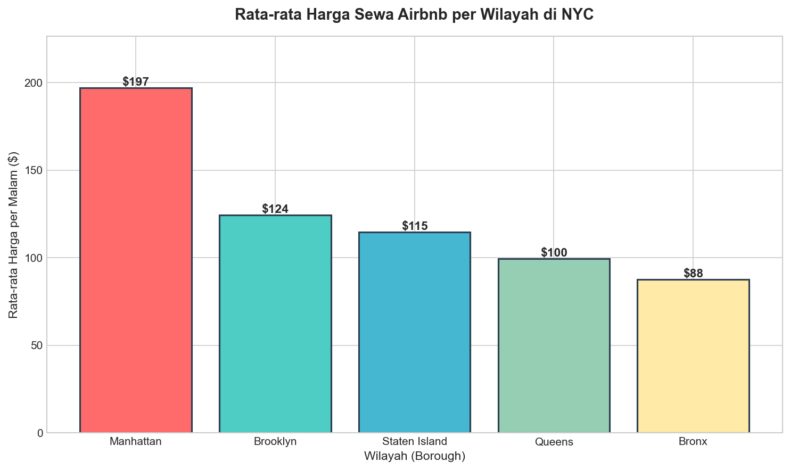
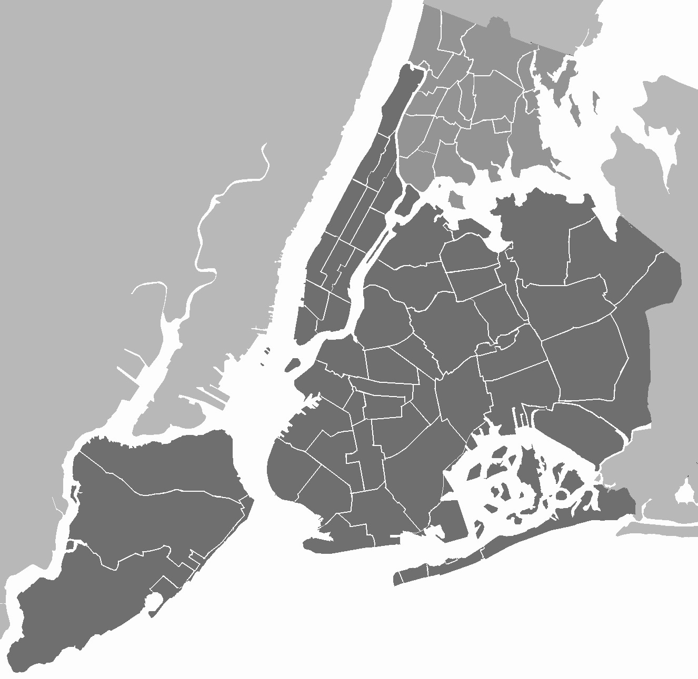
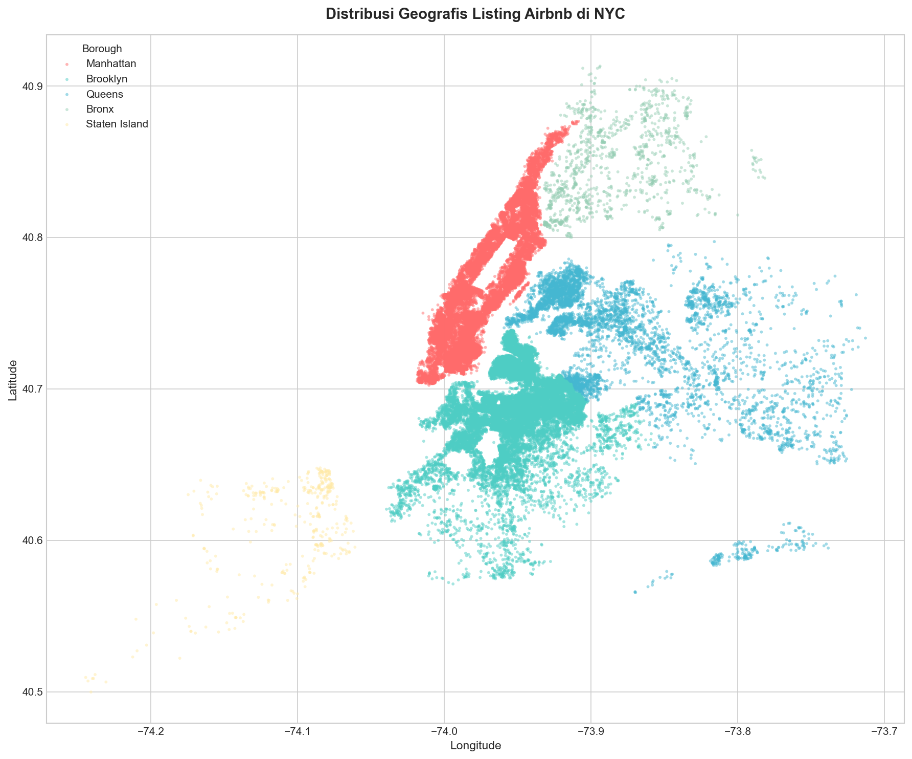
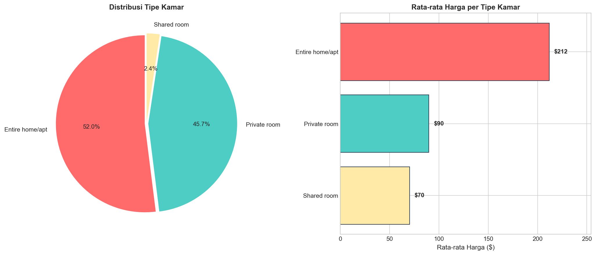

# ETL Pipeline - NYC Airbnb Data Analysis

Simple ETL pipeline untuk membersihkan dan menganalisis dataset Airbnb New York City 2019.


## Daftar Isi

- [Overview](#overview)
- [Project Structure](#project-structure)
- [Quick Start](#quick-start)
- [Data Comparison: Before vs After](#data-comparison-before-vs-after-cleaning)
- [ETL Process](#etl-process)
- [Visualisasi & Analisis](#visualisasi--analisis)
  - [Rata-rata Harga per Borough](#1-rata-rata-harga-per-borough)
  - [Distribusi Geografis Listing](#2-distribusi-geografis-listing)
  - [Analisis Room Type](#3-analisis-room-type)
- [Key Findings Summary](#key-findings-summary)
- [Dataset](#dataset)
- [How to Reproduce](#how-to-reproduce)

---

## Overview

Project ini dibuat sebagai studi kasus Data Engineer internship. Fokus utama adalah membangun pipeline ETL sederhana yang dapat:
- Membaca raw data dari CSV
- Melakukan data cleaning (handling missing values, formatting, filtering)
- Menyimpan cleaned data untuk analisis lanjutan
- Membuat visualisasi dasar untuk eksplorasi data

## Project Structure

```
├── notebooks/
│   └── etl_airbnb.ipynb       # Main ETL notebook
├── tugas-etl-airbnb/
│   └── data/
│       ├── raw/               # Raw dataset
│       └── clean/             # Cleaned output
├── images/                    # Visualisasi hasil analisis
├── requirements.txt
└── README.md
```

## Quick Start

```bash
# Install dependencies
pip install -r requirements.txt

# Run notebook
jupyter notebook notebooks/etl_airbnb.ipynb
```

---

## Data Comparison: Before vs After Cleaning

### Dataset Overview

| Metric | Before | After | Perubahan |
|--------|--------|-------|-----------|
| Jumlah Baris | 48,895 | 48,847 | -48 rows (-0.10%) |
| Jumlah Kolom | 16 | 14 | -2 columns |
| Missing Values | 21,027 | 10,036 | -10,991 |
| Listings price=0 | 11 | 0 | Removed |

### Columns Comparison

**Before (16 columns):**
```
id, name, host_id, host_name, neighbourhood_group, neighbourhood, 
latitude, longitude, room_type, price, minimum_nights, number_of_reviews, 
last_review, reviews_per_month, calculated_host_listings_count, availability_365
```

**After (14 columns):**
```
name, host_id, neighbourhood_group, neighbourhood, latitude, longitude, 
room_type, price, minimum_nights, number_of_reviews, last_review, 
reviews_per_month, calculated_host_listings_count, availability_365
```

**Columns Removed:** `id`, `host_name` (tidak relevan untuk analisis)

### Data Type Changes

| Column | Before | After |
|--------|--------|-------|
| last_review | object (string) | datetime64 |
| reviews_per_month | float64 (with NaN) | float64 (NaN → 0) |

### Missing Values Detail

| Column | Before | After | Action |
|--------|--------|-------|--------|
| name | 16 | 0 | Rows dropped |
| host_name | 21 | - | Column dropped |
| last_review | 10,052 | 10,036 | Keep as-is (valid NaT) |
| reviews_per_month | 10,052 | 0 | Filled with 0 |

---

## ETL Process

### Extract
Baca dataset `AB_NYC_2019.csv` (~49K rows, 16 columns).

### Transform
1. Fill missing `reviews_per_month` dengan 0
2. Drop rows dengan `name` atau `host_name` kosong
3. Convert `last_review` ke datetime
4. Drop kolom `id` dan `host_name`
5. Filter out listings dengan `price = 0`

### Load
Export cleaned data ke `data/clean/airbnb_cleaned.csv`

---

## Visualisasi & Analisis

### 1. Rata-rata Harga per Borough



**Insight:**
- **Manhattan** mendominasi dengan harga tertinggi (~$197/malam) - wajar karena lokasi premium di pusat NYC
- **Brooklyn** di posisi kedua (~$124/malam) - populer untuk wisatawan yang ingin akses ke Manhattan dengan budget lebih rendah
- **Bronx** paling terjangkau (~$87/malam) - cocok untuk budget travelers

Perbedaan harga antar borough mencerminkan lokasi, aksesibilitas transportasi, dan proximity ke tourist attractions.

### 2. Distribusi Geografis Listing

Perbandingan antara peta referensi NYC dengan visualisasi distribusi Airbnb listings:

| Peta NYC (Referensi) | Distribusi Airbnb Listings |
|:---:|:---:|
|  |  |

**Insight:**
- Konsentrasi listing tertinggi ada di **Manhattan** (terutama Midtown, Lower East Side) dan **Brooklyn** (Williamsburg, Bedford-Stuyvesant)
- **Queens** tersebar merata, mostly dekat airport (JFK, LaGuardia)
- **Staten Island** dan **Bronx** punya coverage paling sedikit - potential untapped market
- Perbandingan dengan peta asli menunjukkan bahwa distribusi Airbnb **mengikuti kepadatan penduduk dan area wisata**

Pattern distribusi mengikuti jalur subway dan tourist hotspots.

### 3. Analisis Room Type



**Insight:**
- **Entire home/apt** (52%) adalah tipe paling populer dengan harga premium (~$212/malam) - preferred untuk families dan long stays
- **Private room** (45.7%) menawarkan balance antara privacy dan affordability (~$90/malam)
- **Shared room** hanya 2.3% - niche market untuk solo budget travelers (~$70/malam)

Tren menunjukkan preference tamu untuk privacy, tapi private room tetap kompetitif dari segi value.

---

## Key Findings Summary

| Borough | Avg Price | Total Listings | Market Share |
|---------|-----------|----------------|--------------|
| Manhattan | $197 | 21,649 | 44.3% |
| Brooklyn | $124 | 20,089 | 41.1% |
| Queens | $100 | 5,648 | 11.6% |
| Staten Island | $115 | 373 | 0.8% |
| Bronx | $87 | 1,088 | 2.2% |

**Takeaways:**
- Manhattan + Brooklyn = 85% market share
- Price premium di Manhattan justified by demand
- Outer boroughs (Bronx, Staten Island) = opportunity untuk budget segment

---

## Dataset

Source: [Kaggle - NYC Airbnb Open Data](https://www.kaggle.com/datasets/dgomonov/new-york-city-airbnb-open-data)

| Info | Value |
|------|-------|
| Total Records | 48,895 → 48,847 |
| Features | 16 → 14 columns |
| Period | 2019 |
| Coverage | 5 NYC Boroughs |

---

## How to Reproduce

1. Clone repository
2. Install dependencies: `pip install -r requirements.txt`
3. Run notebook: `jupyter notebook notebooks/etl_airbnb.ipynb`

---
